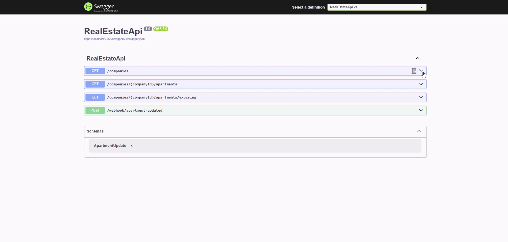
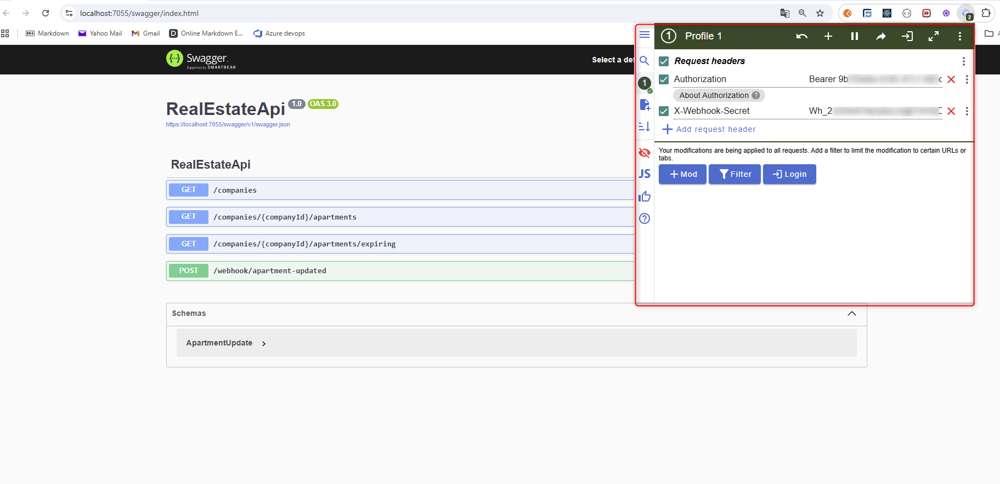

# Komma igång med ASP.NET Core Web API (.NET 8)

## RealEstateApi  
Ett enkelt **ASP.NET Core Web API (.NET 8)** med **EF Core (Code First)** för bolag och lägenheter samt ett minimalt **webhook**-endpoint.

```bash
dotnet new webapi -n RealEstateApi -f net8.0
```



---

## Förutsättningar

- **Visual Studio 2022 Community**  
  https://visualstudio.microsoft.com/vs/community/  

- **SQL Server 2022 Express**  
  https://www.microsoft.com/sv-se/sql-server/sql-server-downloads  

- *(Valfritt)* **SQL Server Management Studio (SSMS)**  
  https://learn.microsoft.com/en-us/ssms/install/install  

---

## Viktiga NuGet-paket

- Microsoft.EntityFrameworkCore.SqlServer  
- Microsoft.EntityFrameworkCore.Tools  

---

## Installation & Build

Kör följande efter kloning:  

```bash
dotnet restore
dotnet build
```

Installera EF Core CLI för att hantera migrationer:  

```bash
dotnet tool install --global dotnet-ef
```

---

## Konfiguration

Skapa en fil med namnet ` appsettings.Development.json`  i projektroten och kopiera innehållet från ` appsettings.Template.json` .
Ersätt därefter de exempelvärden som finns i appsettings.Template.json med riktiga värden i den nya filen.

 Alternativ: använd **User Secrets** (rekommenderas i dev):  

```bash
dotnet user-secrets init
dotnet user-secrets set "ConnectionStrings:DefaultConnection" "Server=...;Database=...;..."
osv
```

---

## Code First (Migrations & DB)

Skapa schema:  

```bash
dotnet ef migrations add InitialCreate
dotnet ef database update
```

---

## Testdata

### Snabbast: SQL INSERT
```sql
Companies:
            INSERT INTO Companies (Name) VALUES (N'Riksbyggen'), (N'JM'), (N'HSB');

Apartments:
            INSERT INTO Apartments (Address, CompanyId, LeaseEnd, IsRenovated) VALUES
            (N'Storgatan 1', 1, DATEADD(MONTH, 2, GETUTCDATE()), 0),
            (N'Storgatan 2', 1, DATEADD(MONTH, 4, GETUTCDATE()), 1),
            (N'Storgatan 3', 1, DATEADD(MONTH, 1, GETUTCDATE()), 0),

            (N'Järnvägsgatan 10', 2, DATEADD(MONTH, 5, GETUTCDATE()), 0),
            (N'Järnvägsgatan 12', 2, DATEADD(DAY, 40, GETUTCDATE()), 1),
            (N'Järnvägsgatan 14', 2, DATEADD(MONTH, 3, GETUTCDATE()), 0),
            (N'Järnvägsgatan 16', 2, DATEADD(MONTH, 7, GETUTCDATE()), 1),

            (N'Sveavägen 50', 3, DATEADD(MONTH, 2, GETUTCDATE()), 0),
            (N'Sveavägen 52', 3, DATEADD(MONTH, 8, GETUTCDATE()), 1),
            (N'Sveavägen 54', 3, DATEADD(DAY, 15, GETUTCDATE()), 0);
```


---

## Köra projektet (Debug/Run)
Du kan öppna projektet genom att dubbelklicka på `.sln-filen`

Tryck sedan på F5 för att starta i debug-läge. 

Alternativt kan du köra via terminalen med profilen i `launchSettings.json`:  

```bash
dotnet run --launch-profile "https"
```

 Swagger:  
```
https://localhost:7055/swagger/index.html
```
(Port ser du i konsolen eller `launchSettings.json`.)  

För att testa med headers i Swagger (Chrome + ModHeader):  

- `Authorization: Bearer <din-token>`  
- `X-Webhook-Secret: <ditt-hemliga-värde>`  



---

## API-exempel

- `GET /companies` – lista bolag  
- `GET /companies/{companyId}/apartments` – lägenheter för bolag  
- `GET /companies/{companyId}/apartments/expiring` – kontrakt som går ut inom 3 mån  
- `POST /webhook/apartment-updated` – webhook för lägenhet  

---

## Webhook (exempel)

`POST /webhook/apartment-updated`  

```json
{
  "apartmentId": 1,
  "isRenovated": true,
}
```

---

## Felsökning


-  **HTTPS-problem** →  
  ```bash
  dotnet dev-certs https --trust
  ```  
-  **Connection string saknas** → Lägg till i `appsettings.Development.json` eller via secrets.  

---
